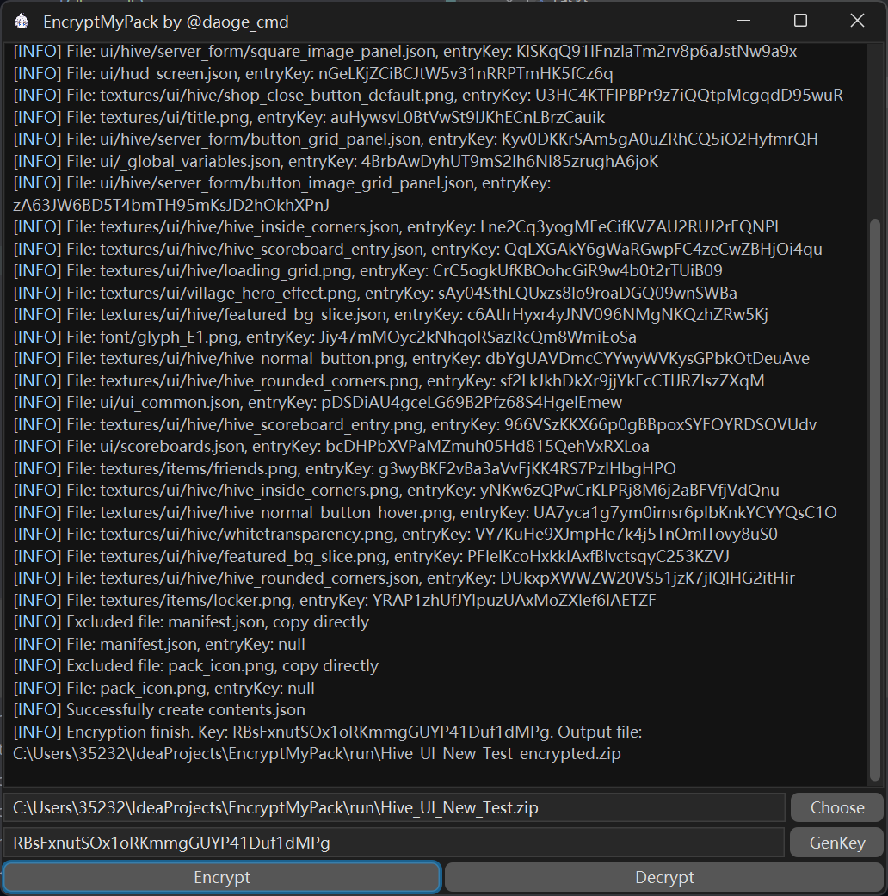

# EncryptMyPack


A small util for encrypting and decrypting resource packs.



## 🌟 Feature

- An easy to use graphical interface
- Encrypt and decrypt resource packs
- Support resource pack that contains sub packs

## 🔨 Usage

Download the latest jar file from [release](https://github.com/AllayMC/EncryptMyPack/releases/latest). Before
using this tool, make sure you have Java 21+ installed. Double click the jar file to run it, or run the following command in terminal:

```bash
java -jar EncryptMyPack-<version>-shaded.jar
```

### Encryption

1. The key should be a 32 character long string. You can click `GenKey` button to generate a random key
2. Make sure your pack is a zip file, and in your pack should be a manifest.json

After the encryption, a `contents.json` file should now be in output zip file, and the key will be displayed in the console

### Decryption

1. Again, the key should be a 32 character long string
2. To decrypt the pack, you must provide its key

## 🎫 License

Copyright **© 2023-2025 AllayMC**, all rights reserved. LGPL-3.0

## ❤️ Special thanks

Thanks to [mcrputil](https://github.com/valaphee/mcrputil) for their great work!
